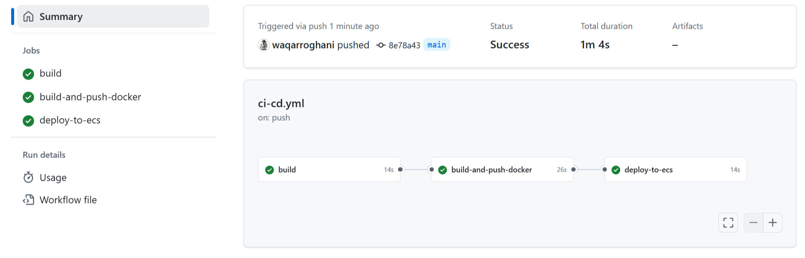
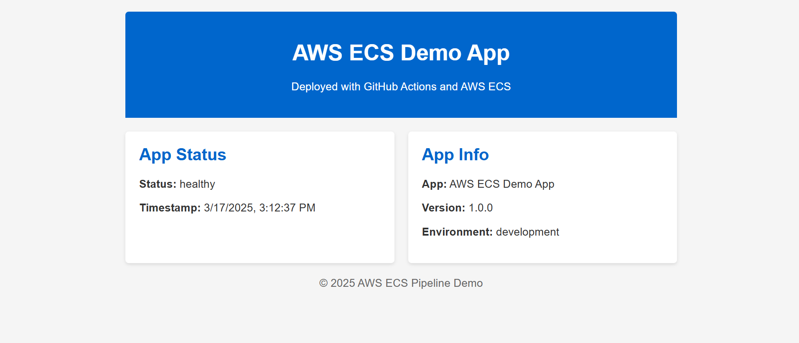

# CI/CD Pipeline with GitHub Actions and Docker

## Overview
This project demonstrates a **CI/CD pipeline** using **GitHub Actions**, **Docker**, and **AWS ECS**. The pipeline automates the build, test, and deployment of a containerized Node.js app to AWS ECS.

## Tech Stack
- **GitHub Actions**: Automates CI/CD workflows.
- **Docker**: Containerizes the application.
- **AWS ECR**: Stores Docker images.
- **AWS ECS**: Deploys and manages the containerized app.

## Features
- Automated build, test, and deployment pipeline.
- Push Docker images to AWS ECR.
- Deploy the app to AWS ECS using Fargate.

## Repository Structure
aws-ecs-demo-app/
├── .github/
│ └── workflows/
│ └── ci-cd.yml # GitHub Actions workflow
├── public/
│ ├── index.html # Frontend files
│ ├── styles.css
│ └── script.js
├── tests/
│ └── app.test.js # Unit tests
├── app.js # Backend code
├── Dockerfile # Docker configuration
├── package.json # Node.js dependencies
├── package-lock.json
├── 
└── README.md # Project documentation

- screenshots
     ```markdown
     
     

## How It Works
1. **GitHub Actions** triggers on every push to the `main` branch.
2. The pipeline:
   - Builds and tests the application.
   - Builds a Docker image and pushes it to **AWS ECR**.
   - Deploys the Docker image to **AWS ECS**.

## Setup Instructions
1. Clone the repository:
   ```bash
   git clone https://github.com/waqarroghani/aws-ecs-demo-app.git
Configure AWS credentials in GitHub Secrets:

AWS_ACCESS_KEY_ID

AWS_SECRET_ACCESS_KEY

AWS_REGION

ECR_REPOSITORY_URI

Push changes to the main branch to trigger the pipeline.


---
